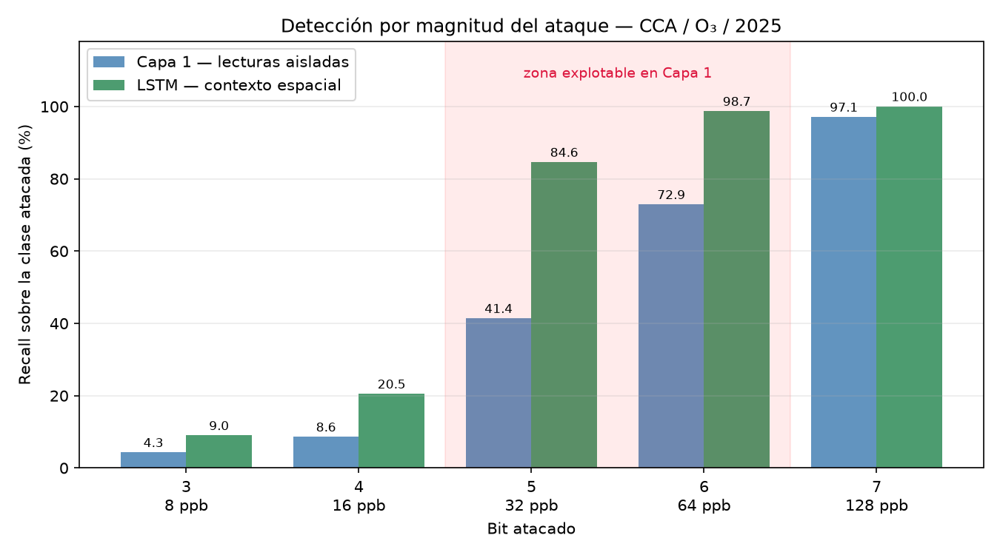
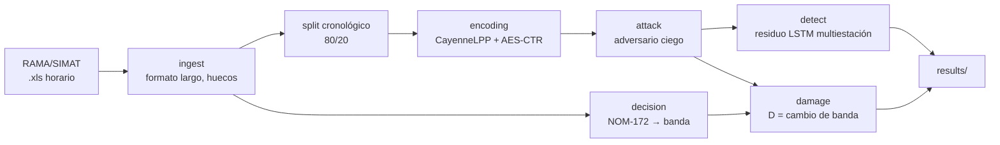

<div align="center">

# Detección de ataques de *bit flipping* en LoRaWAN 1.1

**Caracterización del daño y la detectabilidad en función de la posición atacada,
sobre mediciones reales de calidad del aire**

[](https://www.python.org/)
[](tests/)
[](docs/progreso.md)
[](docs/01_umbrales_normativos.md)
[](https://www.pcic.unam.mx/)

Trabajo de tesis de maestría · Posgrado en Ciencia e Ingeniería de la Computación, UNAM
<br>
José Emiliano Lili Beltrán · Asesor: Dr. José Jaime Camacho Escoto

</div>

---

## El problema

En LoRaWAN la confidencialidad y la integridad se proveen por mecanismos
independientes, y eso abre una grieta explotable:

- El `FRMPayload` se cifra con **AES en modo contador**. El cifrado es un XOR
  contra un flujo de clave, así que alterar un bit del texto cifrado altera el
  bit correspondiente del texto claro. El adversario no necesita la clave.
- La integridad la protege el **MIC**, cuya verificación **termina en el Network
  Server**. El segmento entre el NS y el Application Server queda sin protección
  de integridad extremo a extremo.

La vulnerabilidad es arquitectónica, no un defecto de implementación de una
versión concreta: afecta por igual a los despliegues 1.0.x y 1.1.

Este repositorio no se limita a distinguir mensajes alterados de legítimos.
Mide **qué posiciones de bit producen consecuencia real** sobre la decisión que
toma la aplicación receptora, y con qué probabilidad esa alteración pasa
inadvertida.

```
D = 1 [ f(x_real) ≠ f(x_recibido) ]
```

donde `f` es la clasificación normativa en bandas de calidad del aire de la
**NOM-172-SEMARNAT-2023** (umbrales de O₃ en 58 / 90 / 135 / 175 ppb). El daño
no es la magnitud del desplazamiento, sino el cambio de decisión. Un salto de
32 ppb lejos del corte no produce efecto; uno de 2 ppb junto al corte cambia la
banda que se comunica a la población.

---

## Resultados principales

| | Medición aislada | Con contexto espacial |
|---|---:|---:|
| Detección · desplazamiento de 32 ppb | 41.4 % | **84.6 %** |
| Detección · desplazamiento de 64 ppb | 72.9 % | **98.7 %** |
| Máximo daño no detectado | 27.1 % (64 ppb) | **9.1 % (16 ppb)** |

**Existe un óptimo interior del adversario.** Por debajo de cierta magnitud las
alteraciones son indetectables pero inocuas: no llegan a cruzar el umbral
normativo. Por encima, producen valores fuera del rango físicamente observado y
se detectan por simple verificación de rango. El máximo de daño no detectado
está en medio.

**El contexto espacial cierra la ventana.** Un LSTM que estima el valor esperado
de la estación objetivo a partir de las 32 restantes de la red no sólo mejora la
detección: desplaza el óptimo del adversario hacia desplazamientos de 16 ppb,
magnitud en la que sólo el 11.4 % de los ataques llega a cambiar la banda.

<p align="center">
  
</p>

**Hallazgo metodológico: deriva estacional.** Un detector basado en predicción
entrenado sobre un régimen estacional presenta sesgo sistemático al operar sobre
otro. El perfil horario de enero–octubre subestima en 10.6 ppb la concentración
real de noviembre–diciembre a las 16 h, justo en la franja de mayor proximidad a
los umbrales. Se adoptó un perfil adaptativo de media móvil causal de 14 días,
que empeora el MAE global (9.35 frente a 8.39 ppb) pero reduce el sesgo de +18.7
a −1.7 ppb. La conclusión trasciende el dominio: todo detector por predicción
sobre series ambientales exige recalibración continua de su línea base.

---

## Alcance experimental

**Datos reales, transporte simulado.** Las series provienen de la Red Automática
de Monitoreo Atmosférico de la Ciudad de México (SIMAT), ozono horario de 2025,
33 estaciones, estación objetivo CCA. El transporte LoRaWAN se reproduce en
simulación: las lecturas se codifican en CayenneLPP y se cifran conforme a la
especificación 1.1, y sobre ese flujo se aplican las alteraciones.

La decisión es deliberada. Sin verdad de referencia exacta por mensaje no es
posible cuantificar el daño, y esa referencia no existe en una captura de
tráfico real.

---

## Arquitectura del pipeline



El ataque se genera **siempre después** de la partición cronológica. Atacar
antes permitiría que la misma lectura apareciera atacada en un conjunto y limpia
en el otro.

---

## Estructura

```
src/
  ingest/rama.py        Lectura de .xls SIMAT, formato largo, huecos, split cronológico
  decision/nom172.py    Bandas del Índice AIRE Y SALUD para O₃ (Tabla 6)
  decision/damage.py    Métrica de daño: cambio de decisión
  encoding/cayenne.py   CayenneLPP Analog Input, big-endian, flip_bit
  encoding/crypto.py    Cifrado del FRMPayload, LoRaWAN 1.1 §4.3.3
  attack/blind.py       Generación de datasets atacados (adversario ciego)
  detect/windows.py     Ventanas deslizantes multiestación, perfil horario adaptativo
  detect/lstm.py        Modelo de predicción espacial

notebooks/              01 inspección · 02 ingesta · 03 decisión · 04 encoding
                        05 ataque · 06 detección · 07 multiestación · 08 proximidad
docs/                   Notas metodológicas, registro de progreso, figuras
results/                Métricas de detección, en CSV
tests/                  Pruebas de ingesta, decisión y codificación
data/samples/           Muestra de dataset atacado, para inspección rápida
```

---

## Instalación

```bash
git clone https://github.com/JoseLili/lorawan11-rama-detection.git
cd lorawan11-rama-detection

python3 -m venv .venv && source .venv/bin/activate
pip install -r requirements.txt

pytest -q
```

### Datos

Los datos crudos **no están versionados**. Descárgalos del portal de datos
abiertos de la Dirección de Monitoreo Atmosférico de la Ciudad de México y
colócalos en `data/raw/`. Las sumas de verificación de los archivos empleados
están en [`docs/checksums_2025.txt`](docs/checksums_2025.txt), de modo que
cualquiera pueda confirmar que trabaja sobre los mismos archivos.

`data/samples/` contiene un dataset atacado ya generado, suficiente para
inspeccionar el formato sin descargar nada.

### Uso mínimo

```python
from src.encoding.cayenne import encode_o3, decode_o3, flip_bit
from src.decision.damage import daño

trama = encode_o3(87)            # 87 ppb → banda Aceptable
alterada = flip_bit(trama, 5)    # el adversario voltea el bit 5 (±32 ppb)

daño(87, decode_o3(alterada))    # 1 si el ataque cambió la banda reportada
```

---

## Decisiones metodológicas

Documentadas con su fundamento en `docs/`. Las que más condicionan los
resultados:

| | Decisión | Por qué |
|---|---|---|
| **D7** | CayenneLPP Analog Input (`0x02`), 2 bytes big-endian, reinterpretado a 1 ppb/LSB | El tipo *Concentration* no figura en la tabla oficial de myDevicesIoT; se descartó por credibilidad |
| **D8** | Los faltantes **no se imputan**: se representan como ausencia de mensaje | 0 ppb es un valor real observado, así que no admite centinela; `-99` es artefacto del formato SIMAT, no de LoRaWAN |
| | Partición **cronológica**, nunca aleatoria | Una partición aleatoria sobre series temporales filtra información del futuro y produce métricas engañosas |
| | El modelo se entrena **sólo con tráfico legítimo** | No ve ataques durante el entrenamiento; la detección es por residuo |
| | El perfil horario se calcula **sólo sobre el conjunto de entrenamiento** | Calcularlo sobre todo el periodo contaminaría la evaluación |

---

## Limitaciones

Enunciadas de frente, porque condicionan la interpretación de las cifras:

- **Falsos positivos.** 131 alarmas sobre 1 684 horas de prueba: dos alarmas
  diarias por estación. Escalado a la red completa, el volumen exige agregación
  o verificación adicional.
- **Resolución.** La desviación del residuo ronda los 13 ppb, y 19 ppb en el
  máximo vespertino. Los desplazamientos por debajo de 20 ppb quedan fuera de
  alcance. No es un fallo de implementación: es el límite del método.
- **Supuesto de nodo único.** Un adversario que comprometiera varias estaciones
  de forma coordinada anularía la coherencia espacial en que se apoya la
  detección.
- **Un solo perfil de adversario.** El detector espacial se ha evaluado frente
  al atacante de posición fija. El de magnitud variable, que degradó la
  detección sobre mediciones aisladas del 41.4 % al 11.4 %, aún no se ha
  probado contra el modelo espacial.

---

## Referencias

- LoRa Alliance. *LoRaWAN™ 1.1 Specification*, 2017.
- J. Lee, D. Hwang, J. Park, K.-H. Kim. «Risk analysis and countermeasure for
  bit-flipping attack in LoRaWAN». *ICOIN*, 2017.
  [10.1109/ICOIN.2017.7899554](https://doi.org/10.1109/ICOIN.2017.7899554)
- M. Alizadeh, A. J. Bidgoly. «Bit flipping attack detection in low power wide
  area networks using a deep learning approach». *Peer-to-Peer Networking and
  Applications* 16, 2023.
  [10.1007/s12083-023-01511-y](https://doi.org/10.1007/s12083-023-01511-y)
- Y. Liu, P. Ning, M. K. Reiter. «False data injection attacks against state
  estimation in electric power grids». *ACM CCS*, 2009.
  [10.1145/1653662.1653666](https://doi.org/10.1145/1653662.1653666)
- SEMARNAT. *NOM-172-SEMARNAT-2023*. Diario Oficial de la Federación, 2024.

---

## Aviso

Trabajo de investigación académica. Los ataques se generan en simulación, sobre
datos públicos y en un entorno controlado; no se ha intervenido ninguna red en
operación. El objetivo del trabajo es defensivo: caracterizar la superficie de
ataque para poder detectarla.
